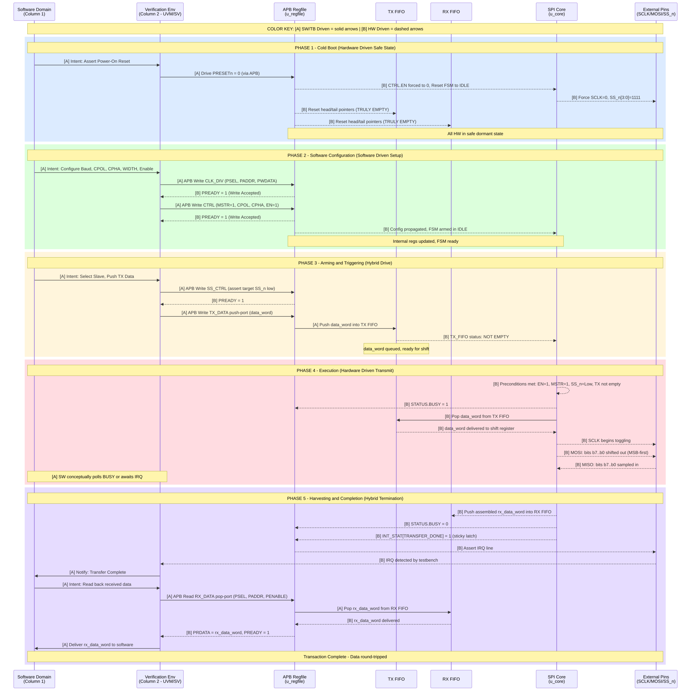

# SPI Master Transaction Lifecycle (Rev 1.1)

> **Target Audience**: DV Engineers reviewing conceptual flow before writing SystemVerilog verification classes.
> **Accuracy**: Transaction-level (not cycle-level). Each phase isolates and labels which entity drives each signal/register bit.

---

## Color Coding Key

| Tag | Domain | What It Covers |
|-----|--------|----------------|
| **[A] Software Driven** (solid arrows) | Column 1 (Software) + Column 2 (Testbench) | APB bus signals driven by TB: `PSEL`, `PENABLE`, `PADDR`, `PWDATA`. Conceptual commands from SW. |
| **[B] Hardware Driven** (dashed arrows) | Column 3 (DUT Internals) | APB responses: `PRDATA`, `PREADY`. SPI pins: `SCLK`, `MOSI`, `SS_n`. FIFO status flags. `IRQ`. |

---

## Embedded Diagram (SVG — zoomable)



---

## Detailed Phase Breakdown

### Phase 1 — Cold Boot (Hardware Driven Safe State)
- **Action**: Forceful DUT state synchronization via Reset.
- **Verification Column Driving**: The testbench explicitly drives `PRESETn` to `0` over the APB interface.
- **Hardware State [B]**: The IP drops into a safe, dormant state. The `CTRL.EN` register bit is forced to `0`. The SPI core forces the external pins to their idle state (`SCLK` forced low, `SS_n[3:0]` forced high). Both the TX and RX FIFOs have their head/tail pointers reset, rendering them truly empty.

### Phase 2 — Software Configuration & Handshake (Software Driven Setup)
- **Software Concept [A]**: Translating abstract intent into configurations — Baud Rate, CPOL, CPHA, Word WIDTH, and Global Enable.
- **Verification Column Driving [A]**: Executes standard APB write transactions to map software intent to hardware reality (driving `PSEL`, `PENABLE`, `PADDR`, `PWDATA`).
  - Sets the `CLK_DIV` register.
  - Sets the `CTRL` register (specifically ensuring `MSTR=1` and `EN=1`).
- **Hardware State [B]**: Hardware responds with `PREADY=1` for each write. Internal configuration registers are updated, and the core FSM sits in the `IDLE` state, fully armed and ready.

### Phase 3 — Arming & Triggering (Hybrid Drive)
- **Software/Verification Action [A]**: Initiating the operational payload trigger.
  - An APB Write to `SS_CTRL` is executed to manually pull a targeted slave select line (`SS_n`) low.
  - An APB Write to the `TX_DATA` push port is executed to load the initial payload (`data_word`).
- **Hardware State [B]**: The internal `TX_FIFO` accepts the `data_word`, successfully transitioning its internal state to `!EMPTY`. The core is notified.

### Phase 4 — Execution (Hardware Driven Transmit)
- **Hardware Action [B]**: The core FSM detects all preconditions are met (`EN=1`, `MSTR=1`, `SS_n` is asserted, and `!TX_EMPTY`). The hardware core actively pops the `data_word` from the `TX_FIFO` into its internal shift register.
- **Hardware Driven Signals [B]**: The `STATUS.BUSY` bit is immediately asserted to `1`. `SCLK` starts toggling. The individual bits of the word appear sequentially on the `MOSI` pin (e.g., `b7` to `b0`, MSB-first based on `WIDTH`). Concurrently, incoming data bits are actively sampled from the `MISO` pin.
- **Software Column [A]**: The UVM/SV environment conceptually polls the `BUSY` status bit via APB reads or waits asynchronously for an Interrupt, operating in parallel to the hardware shift sequence.

### Phase 5 — Harvesting & Completion (Hybrid Termination)
- **Hardware Action [B]**: Upon shifting the final bit, the core completes the physical transaction. The SPI core automatically pushes the fully assembled received payload (`rx_data_word`) into the `RX_FIFO` and immediately resets `STATUS.BUSY` back to `0`. The `INT_STAT[TRANSFER_DONE]` sticky bit is latched. The `IRQ` line is asserted.
- **Verification Column [A]**: The TB detects the completion via Polling or the `IRQ` line. It executes an APB read transaction to the `RX_DATA` pop port to retrieve the payload.
- **Hardware Driven Signal [B]**: The IP core pops the `rx_data_word` from the `RX_FIFO` and drives it onto the APB `PRDATA` bus alongside `PREADY=1` in response to the read transaction, completing the data round-trip back to the software domain.

---

## Data Path Trace (Word-Level)

```
data_word (16/32-bit)
  │
  ├─[A]─► SW conceptualizes payload
  │         │
  │         ▼
  ├─[A]─► TB writes to TX_DATA push-port (APB PWDATA)
  │         │
  │         ▼
  ├─[A]─► u_regfile pushes into TX FIFO
  │         │
  │         ▼
  ├─[B]─► u_core pops from TX FIFO → Shift Register
  │         │
  │         ▼
  ├─[B]─► MOSI pin (bits b7..b0, MSB-first)
  │
  ▼ (simultaneously, return path)
  │
  ├─[B]─► MISO pin (bits b7..b0 sampled)
  │         │
  │         ▼
  ├─[B]─► u_core assembles rx_data_word in Shift Register
  │         │
  │         ▼
  ├─[B]─► u_core pushes to RX FIFO
  │         │
  │         ▼
  ├─[A]─► TB reads from RX_DATA pop-port (APB PRDATA)
  │         │
  │         ▼
  └─[A]─► SW receives rx_data_word
```
